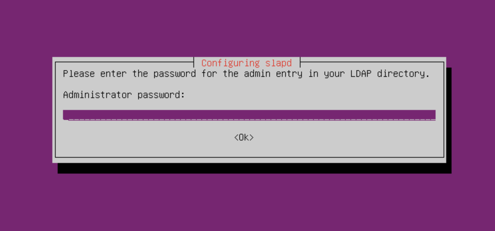

# Configuração do LDAP
### O que é o LDAP?

LDAP é um protocolo padrão que fornece meios de armazenar e recuperar informações sobre pessoas, grupos ou objetos em um servidor de diretórios. Ele permite que os clientes executem uma variedade de operações em um servidor de diretório, incluindo armazenamento e recuperação de dados, pesquisa de dados que correspondam a um determinado conjunto de critérios, autenticação de clientes e muito mais. As portas TCP padrão para LDAP são 389 para comunicação não criptografada e 636 para LDAP em um canal criptografado por TLS.  

### OpenLDAP  

É uma implementação do LDAP, open source e gratuita. É muito usado para a centralização de autenticação e acesso a diretórios na rede.  

### OpenLDAP no Ubuntu Server 

#### Essa instalação foi realizada no ubuntu server 20.04 LTS.
 

- Primeiro temos que atualizar os repositórios e pacotes no servidor. 
  
  > `$ sudo apt update`  
   `$ sudo apt upgrade -y`

- Agora instale o serviço slapd do OpenLDAP, e o ldap-utils para podermos ter acesso aos comandos e utilitários do LDAP:
    
  >`$ sudo apt install slapd ldap-utils -y`

- O slapd vai pedir para informamos uma senha para o administrador.  
  
  

- Inicie o serviço para como o seguinte comando:  
  
  >`$ sudo systemctl start slapd`  

- Entre no diretorio do serviço:  
  
  >`$ cd /etc/ldap`

- É nesse diretório que você vai encontrar os arquivos de configuração do LDAP.  
  
  

- Agora vamos entrar em um diretorio para podermos ver quais são as configurações padrão do LDAP.  
  
  >`$ cd /etc/ldap/slapd.d/cn=config`

  

- Vamos ter que modificar algumas informações do arquivo *olcDatabase={1}mdb.ldif*
  
  

- Temos que mudar as seguintes informações:  
    - olcSufix
    - olcRootDN
    - olcRootPW  
    - ---
  O temos que mudar o olcSufix pois ele vem com valores padrão, e precisamos modificar para o valor que queremos que seja o nó principal da estrutura de diretórios. 
  
  O olcRootDN especifica qual é o DN do administrador, e para mudar para um valor que queremos temos de modificar esse atributo. 
  
  E o olcRootPW especifica qual a senha de administrador, e como já foi definida no início da configuração ela já está setada, mas se quiser modificar temos que mudar esse atributo. 
  
  Mas não podemos modificar esse arquivo diretamente, temos que utilizar uma operação do LDAP para modificar essas informações, e para isso vamos usar o comando ldapmodify.

  ---
 

- Primeiro criamos um arquivo que tenha a extensão .ldif que é para o LDAP poder identificar, e nesse arquivo é que vamos colocar os comandos e atributos para podermos modificar o arquivo principal.
  
  

- Nesse caso criamos o arquivo db.ldif, e é nele onde vamos especificar o que queremos mudar. 
  
  

- Como podemos ver na imagem anterior, nós especificamos quais os atributos do arquivo olcDatabase={1}mdb.ldif que queremos modificar só que agora em outro arquivo.
  
  Primeiro informamos qual o DN do arquivo que queremos modificar, e esse DN serve para podermos identificar uma entrada no LDAP, e como queremos modificar um arquivo temos que passar o DN dele, por isso temos como primeira linha de cada entrada a especificação de DN do arquivo que queremos modificar e o cn=config que especifica que aquela entrada é de configuração. 
  
  Na primeira primeira entrada especificamos o atributo changetype e atribuímos o valor modify, isso identifica que aquela operação vai servir para modificação de informações já existentes. Isso se repete para as outras duas entradas, pois também queremos realizar operações de modificação nelas. 
  
  O atributo replace especifica qual o atributo que queremos modificar no arquivo principal, e o valor que temos que especificar é o atributo que queremos modificar. 
  
  E por fim passamos o atributo, como por exemplo RootDN com o novo valor que queremos que ele tenha.

- Para podermos realizar a modificação temos que utilizar o comando modify do LDAP como já foi dito, então passamos o seguinte comando:
  
  >`$ sudo ldapmodify -Q -Y EXTERNAL -H ldapi:/// -f db.ldif`

  

  Primeiro temos a operação “ldapmodify”  que serve para especificar que essas informações serão para modificação, depois temos o -Q -Y EXTERNAL que serve para especificar que está usando um vínculo SASL e especificando ainda mais o tipo EXTERNAL. Juntamente com -H ldapi:///, isso usa uma conexão de soquete unix local.

  E como podemos ver as informações que modificamos por meio do comando modify em outro arquivo foram implementadas no arquivo principal.

  

- Agora vamos no diretório de schemas, que é onde estão todos os arquivos de schemas que podemos importar para podermos montar entradas com mais  atributos que os que vem como padrão.
  
  

  E então vamos importar alguns schemas importantes para montar a estrutura de entradas, e também vamos importar schemas que vão nos possibilitar montar entradas com atributos de usuários do tipo posix. 
  
  Para podermos importar os schemas temos que utilizar a operação de adição do LDAP, que é ldapadd.

  >`$ sudo ldapadd -Q -Y EXTERNAL -H ldapi:/// -f nomedoarquivo.ldif`

  

  E como podemos ver foram importados os schemas, cosine, inetorgperson e o nis, que especifica os atributos para usuários posix.

  Pronto as configurações principais para o serviços foram feitas, agora é só montar a sua estrutura de diretórios conforme queira.